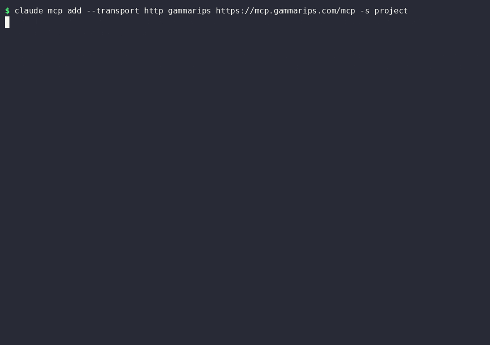

# gammarips-harness

An open-source agentic trading harness for the **GammaRips** options-flow data layer. Clone
it, point it at the GammaRips MCP, and run a disciplined daily loop: your agent reasons over
the curated overnight unusual-options-activity pool to **one trade candidate per day (or
none)**, screens tradeability before thesis, designs its own exit, pre-registers every
decision as data, and scores the whole pool after the close. Paper-only by default.

This is a **workflow, not a signal service.** GammaRips deliberately exposes no
pick-returning endpoint, so there is nothing to copy. Two agents reasoning over the same
pool, with different objectives and risk, should reach different contracts. The value is
your analysis over shared data.

## Try the data first (no key, no card, about ten seconds)

You do not need an account to see what this is built on. Point any MCP client at the
anonymous tier:

```bash
claude mcp add --transport http gammarips https://mcp.gammarips.com/mcp
```

Then ask your agent for this morning's brief. The anonymous tier serves the pool preview,
the daily report, regime context, the market calendar, and the methodology playbooks, with
no signup. If the data is not interesting to you, you have spent ten seconds and you stop
here.



The recording above is real output from the free tier on 2026-08-22. Nothing is staged. The run names no contract to buy, by design.

## Install as a Claude Code plugin (two commands)

If you use Claude Code, install the harness as a plugin:

```
/plugin marketplace add DevDizzle/gammarips-harness
/plugin install gammarips@gammarips
```

The plugin bundles the GammaRips MCP server, the three loop skills (`/gammarips:trade`,
`/gammarips:review`, `/gammarips:coach`), and the `wiki-librarian` agent. The bundled
server is the anonymous endpoint, so the five free tools answer immediately with no key
and no account. For the paid tools, export your key as `GAMMARIPS_MCP_KEY` and start
Claude Code again, because the plugin sends that variable as a bearer token.

The skills write your dataset to `eval/` and call `scripts/`, so run them inside a clone
of this repo. The plugin gives you the server and the skills. The clone gives you the
data directory and the scripts.

## Running the harness (this part needs a key)

Be clear about which side of the line the harness sits on. Its screen is built on the paid
tools, so the daily loop will not run on the anonymous tier:

| Tool | Tier | What the loop uses it for |
|---|---|---|
| `get_pool` | free preview, pro full | the candidate pool; the screen needs the enriched view |
| `get_daily_report` | free | overnight market context |
| `get_regime_context` | free | the VIX term-structure rail |
| `get_market_calendar_status` | free | session timing |
| `get_playbook` | free | the methodology the agent reasons with |
| `get_liquidity` | **pro** | tradeability grading, which runs before any thesis |
| `get_signal` | **pro** | enriched per-name detail |
| `query_outcomes` | **pro** | scoring every pool name after the close |
| `replay_contract` | **pro** | exit-rule simulation |

Tradeability grading and honest after-the-close scoring are the whole point of the loop,
and both are pro. The harness is free; the data is what costs money.

1. **Subscribe** at [gammarips.com/pricing](https://gammarips.com/pricing) ($39/mo, 7-day
   free trial).
2. **Create your key** at [gammarips.com/account](https://gammarips.com/account). It is
   shown once, so copy it then.
3. **Export it:**
   ```bash
   export GAMMARIPS_MCP_KEY="<your key>"
   ```
   `.mcp.json` reads this from the environment. Never hardcode the key.
4. **Open the repo in Claude Code** (or any MCP client that reads `.mcp.json`). The
   `gammarips` server connects over Streamable HTTP.
5. **Run the loop:**
   ```
   /trade    morning consult: screen the pool, rank 2-3 candidates or no-trade; you decide
   /review   after the close: score EVERY pool name, backfill the 3-day window
   /coach    on demand: behavioral feedback with receipts from your own record
   ```
   `scripts/edge.py` and `scripts/skill_eval.py` accumulate the evidence across days and
   say, with their own sample-size warnings, whether the screen is earning its keep.

## What's in here

| Path | What |
|---|---|
| `CLAUDE.md` | agent entry point: mission, non-negotiables, the loop |
| `docs/TRADING-DOCTRINE.md` | the rules: hard exclusions, tradeability, sizing (set your own), exit discipline |
| `docs/OPERATIONS.md` | MCP connection, timing, session procedure |
| `.claude/skills/` | the procedures: trade, review, coach, wiki-distill, ste100 (writing style) |
| `.claude/agents/` | wiki-librarian (wiki health) |
| `.claude-plugin/` | plugin + marketplace manifests: install this repo as the `gammarips` Claude Code plugin |
| `wiki/` | claim-tagged knowledge notes (`findings/`, `literature/`) + registries in `_index/` |
| `eval/` | YOUR dataset: funnel log, fills, behavior ledger, findings (starts empty) |
| `scripts/` | validators (funnel_log, behavior_log, lint) + evidence (edge, skill_eval) |

## Discipline

- **Tradeability before thesis.** The screen grades every name on early prints and book
  honesty before any story is considered. An untradeable winner is not a missed trade.
- **Pre-register before outcome.** One funnel row per pool name, written before any
  outcome is known; `/review` scores all of them, including everything the screen
  dropped. Scoring only your own picks cannot tell you whether the screen works.
- **Cite claims with their maturity tag and exit-context.** An edge is exit-conditional;
  a finding without its N is not admissible.
- **The coach never advises.** `/coach` referees your behavior against your own written
  rules, with receipts from your own record. It never says buy or sell.

## Not investment advice

GammaRips is a data vendor. Everything here is educational and on a paper-trading basis
by default. Nothing in this repo is investment advice. Trade your own capital at your own
risk, and get qualified securities and tax counsel before trading real money, especially
if you publish signals you also trade.
